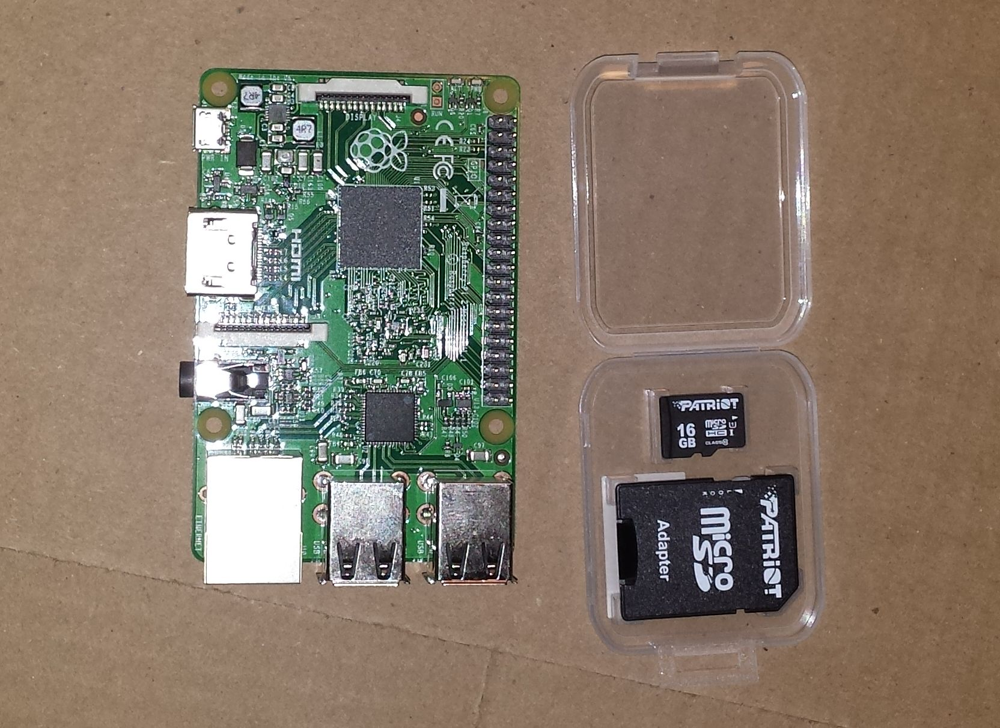
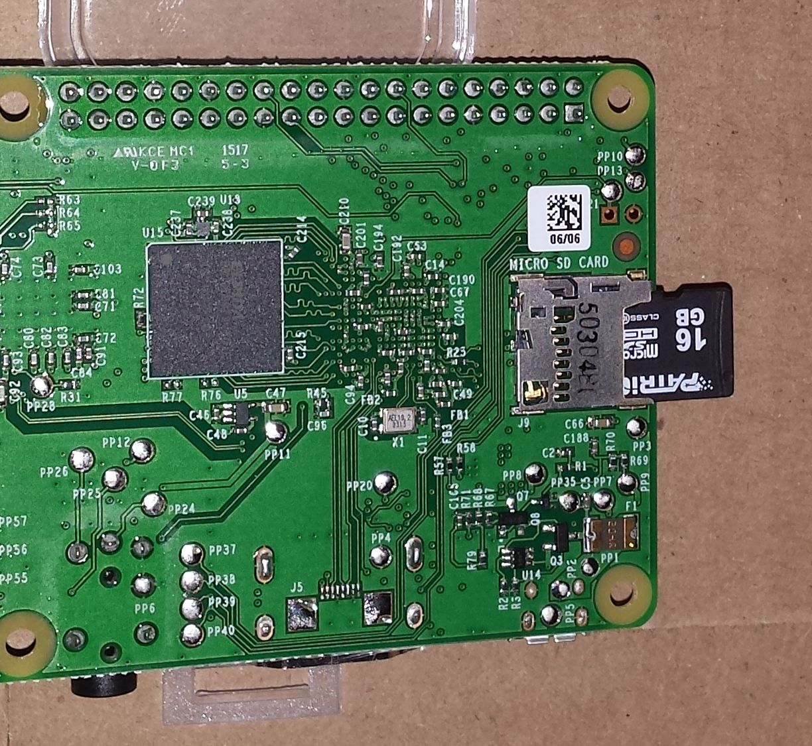
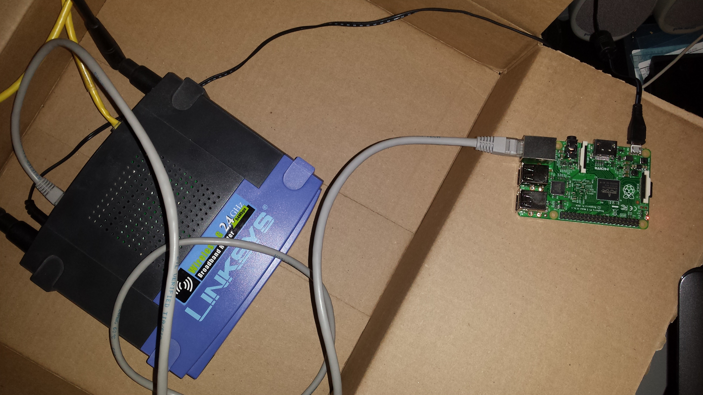
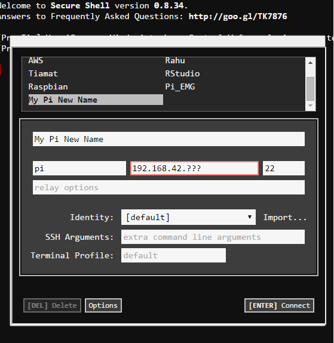

[Home](index.html)

# Description

This guides a beginner to perform an initial setup of a Raspberry Pi. A coach should be nearby to assist when needed.

# Next up?

After reading this guide, you may be interested in reading:

+ [RPi Desktop Mods](rpi_gui_changes.html), Changes to the packages and defaults of the full Raspian

# Overview

A coach provides:

+ a connected Core Pi v2
+ a MicroSD with Raspbian image installed
+ a Chrome browser with the Secure Shell and VNC Viewer apps installed

You provide:

+ a name for your new pi (required)
+ a password for your pi (required)

Some useful information is:

+ SSID to connect to is _corepiv2_
+ Corepiv2 wifi password is _raspberry_
+ New pi username/password is _pi/raspberry_
+ Core Pi router IP address is _192.168.42.1_
+ Core Pi microcomputer IP address is _192.168.84.1_

The steps to follow for easy setup are:

1. [Attach your pi](#1)
2. [Connect to your Pi](#2)
3. [Run first boot setup](#3)
4. [Update and upgrade](#4)
5. [Improving security](#5)
6. [Connect with VNC](#6)
7. [Personalize your desktop](#7)
8. [Conclusion](#Conclusion)

## <a name="1"></a>Attach your pi

_Time to complete is about 5 minutes._

[What is a Raspberry Pi?](https://www.raspberrypi.org/help/what-is-a-raspberry-pi/)

Your new pi is a microcomputer and a MicroSD card as shown in the photo. You may also have a USB wifi dongle.



Insert the MicroSD card into the slot on the bottom of the pi. the MicroSD acts as the hard drive of your computer.



Use the Ethernet cable to connect your pi to the Ethernet switch. Provide power via the microUSB. This is the same as a smartphone power cord.



Your pi is now attached.

## <a name="2"></a>Connect to your Pi

_Time to complete is about 10 minutes._

### Wifi access point

Using standard methods connect your computer to the corepiv2 access point. The name is _corepiv2_ and the password is _raspberry_.

### Find your new pi's IP address

[What is an IP address?](http://whatismyipaddress.com/ip-address)

+ Point your browser to [192.168.42.1](http://192.168.42.1/Info.htm)
+ Browse to the bottom of the page to the section _DHCP Clients_
+ Note the IP Address of your newly connected raspberrypi. In this guide, anytime you see **newpi_IP** it refers to this IP Address.

### SSH

[What is Secure Shell?](http://encyclopedia.kids.net.au/page/ss/SSH)

Use the Secure Shell app to connect to your new pi. Start a [New Connection] and then then name your connection _whatever name you picked for your pi_. The username is _pi_, the hostname is _newpi_IP_, and the port is _22_. No other information is needed and you may click _Connect_. Your information should appear similar to this image.



Since this is your first time connecting to this pi, you should receive the message:

    Connecting to pi@newpi_IP...
    Loading NaCl plugin... done.
    The authenticity of host 'newpi_IP (newpi_IP)' can't be established.
    ECDSA key fingerprint is 2a:a7:94:bd:45:f2:00.
    Are you sure you want to continue connecting (yes/no)?

Enter **yes**

You will now see a prompt to enter a password. The password is _raspberry_. If instead you get an error message such as:

    @@@@@@@@@@@@@@@@@@@@@@@@@@@@@@@@@@@@@@@@@@@@@@@@@@@@@@@@@@@
    @ WARNING: REMOTE HOST IDENTIFICATION HAS CHANGED! @
    @@@@@@@@@@@@@@@@@@@@@@@@@@@@@@@@@@@@@@@@@@@@@@@@@@@@@@@@@@@
    IT IS POSSIBLE THAT SOMEONE IS DOING SOMETHING NASTY!
    Someone could be eavesdropping on you right now (man-in-the-middle attack)!
    It is also possible that a host key has just been changed.
    The fingerprint for the ECDSA key sent by the remote host is
    d6:be:12:7e:22:23:c3
    Please contact your system administrator.
    Add correct host key in /.ssh/known_hosts to get rid of this message.
    Offending ECDSA key in /.ssh/known_hosts:7
    ECDSA host key for xxxxxxxxxxxxx.yyy.au has changed and you have requested strict checking.
    Host key verification failed.
    NaCl plugin exited with status code 255.
    (R)econnect, (C)hoose another connection, or E(x)it?

talk to your coach. Your coach may choose to follow this [SSH hint](ssh.html#Chrome_01).

## <a name="3"></a>Run first boot setup

_Time to complete is about 10 minutes._

Start the configuration software to expand the filesystem, change the password, and change the hostname. Enter the configuration with this command, `sudo raspi-config`.

+ Select and execute **Expand Filesystem**
+ Select and execute **Change User Password**
+ Select and execute **Internationalization Options**
    - **Change Locale** to your locale.
        - Use spacebar to select/deselect
        - Deselect en_GB.UTF-8 UTF-8
        - Select en_US.UTF-8 UTF-8
        - OK
        - Select en_US.UTF-8 UTF-8 as default and then OK
    - **Change Timezone** to UTC.
+ Select **Advanced Options** and select and execute **Hostname**. _Pick a unique and easy to remember hostname. This will be used to connect later._
+ Reboot your system `sudo reboot now`.

**INFO: The pi may be shutdown from the command line with, `sudo shutdown now`. Wait about a minute and remove power.**

## <a name="4"></a>Update and upgrade

_Time to complete is about 5 minutes. This does not include the amount of time required to upgrade. Upgrading your system may take an hour with a slow connection and many upgrades._

It is important to keep your pi's software up to date. This is commonly done using apt-get. The main keywords to know are _update_, _upgrade_, _install_, and _remove_. So let's make the system current.

### Use the corepi cache

The corepi system uses a cache to locally connected pies. A single line added to a configuration file makes this available.

+ `sudo nano /etc/apt/apt.conf.d/02proxy`
    - Learn about _nano_, the editor used to write the configuration file. [The Beginner’s Guide to Nano](http://www.howtogeek.com/howto/42980/the-beginners-guide-to-nano-the-linux-command-line-text-editor/)
+ Add the line `Acquire::http { Proxy "http://192.168.84.1:3142"; };`

### Upgrade

+ Update the packages list, `sudo apt-get update`.
+ Upgrade software packages to the current version, `sudo apt-get upgrade`.
+ Relax, this might take a while. Maybe grab lunch.

## <a name="5"></a>Improving security

Some general rules to security are:

* Do not use default passwords
* Use multifactor authentication
* Do not provide shell access unless it is needed
* Do not provide services you do not need
* Do not needlessly expose services
* Apply security patches
* Prevent physical access
* Use quality cryptology

In this beginner's guide, only one additional area of security will be improved. You should already have changed the main password. If you haven't, revisit [Run first boot setup](#3) and change it now.

### SSHd configuration

_Time to complete is about 5 minutes._

There are a few SSHd configuration changes that will improve SSH security. Since SSHd is likely a service you do want to provide and it gives shell access, this is important.

+ Edit the configuration file, `sudo nano /etc/ssh/sshd_config`
+ Change the following:

```
PermitRootLogin no
```

+ Add the following:

```
AllowUsers pi
# Even better if you use a non-default user
```

## <a name="6"></a>Connect with VNC

[What is VNC?](https://www.realvnc.com/support/faq.html#philosophy)

**NOTE: There are many security problems in current vnc implementations. Permit  access to vnc servers on the local network only.**

+ Install TightVNC Server, `sudo apt-get install tightvncserver`.
+ Start the server, `vncserver -nolisten tcp -nevershared -dontdisconnect :1`.
    - Learn more with `man vncserver`, `man Xvnc`, and `Xvnc -help`
+ Enter the requested new  _vnc password_, a view-only password is not needed.
    - If you later wish to set a different password simply `rm .vnc/passwd`
+ Start the VNC Viewer app from Chrome
+ For the address, enter _newpi_IP:1_
+ Your information should appear similar to this image.

**INFO: Stop the server with `vncserver -kill :1`**


+ Click Connect
+ When requested, enter your _vnc password_
+ You should now be viewing the desktop on your new pi

## <a name="7"></a>Personalize your desktop

Since you are now looking at the desktop of your raspberry pi, start making it your own. Start with [RPi Desktop Mods](rpi_gui_changes.html).

## <a name="Conclusion"></a>Conclusion

Use your pi! Explore the menu system. Show no fear in the command line. You cannot harm this computer by any actions taken through SSH or VNC.
