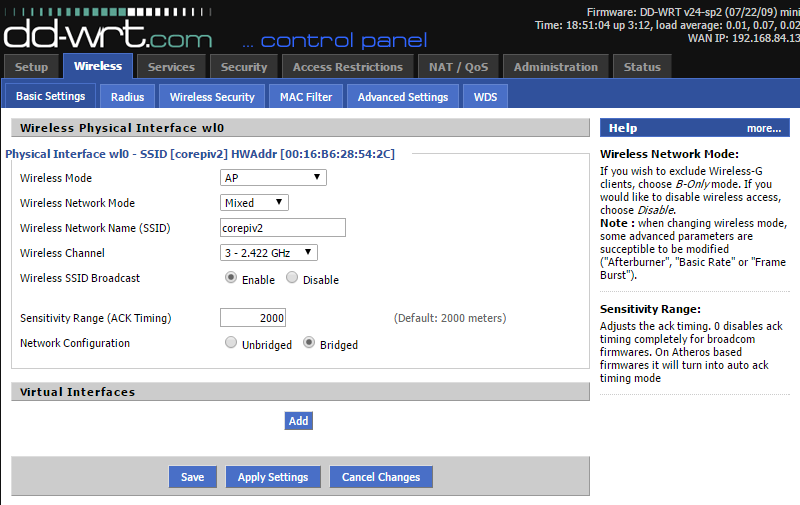
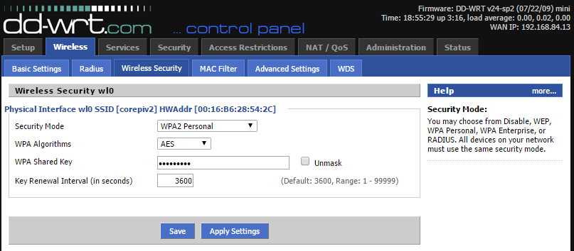

[Home](index.html)

# Description

Core Pi v2 joins a pi used as a wifi to eth0 bridge with a spare wifi access point to provide easy setup of new pies. It also provides a local network for working with pies. Core Pi connects to the Internet via wifi, provides a wifi access point, and acts as a DHCP router for a pies direct connected with Ethernet cable.

Recent Raspbian versions are ready for SSH connection over Ethernet cable. Core Pi takes advantage of that to ease initial connection and setup. I am using this in a learning lab environment with Chromebooks.

# Next up?

After reading this guide, you may be interested in reading:

- [Using CorePi](using_core_pi_v2.html)
- [Beginner Guide via Core Pi v2](beginner_guide_via_core_pi v2.html)

# Parts List

+ Raspberry Pi 2
+ 16GB (or larger) class 10 MicroSD card
+ USB WiFi
+ Pi Case
+ Mini-USB power
+ Ethernet cable
+ Wireless router with at least 4 port Ethernet switch
    - I used a spare [Linksys WRT54GL](http://www.linksys.com/us/p/P-WRT54GL/)
    - This router already had [dd-wrt](https://www.dd-wrt.com) installed.
    - The specific router and dd-wrt are not required but this guide's instructions may be specific to them

# Overview

Start with a Raspberry Pi image. This is an image saved after following the [RPi Initial Setup Guide](rpi_initial_setup.html) and [RPi Desktop Mods](rpi_gui_changes.html). The image should not be Lite. If you do not have such an image, start with a Raspbian image and follow the Initial Setup Guide until reaching [Update and upgrade the Pi](rpi_initial_setup.html#6). Now, jump to [Install Apt-Cacher-NG](#4) of this guide before completing the Initial Setup Guide and the Desktop Mods. Once those are completed, return here.

## Wireless router

1. [Reset the router](#wr1)
2. [Connect to the router](#wr2)
3. [Router settings - Basic Setup](#wr3)
4. [Router settings - Wireless Basic Setup](#wr4)
5. [Router settings - Wireless Security](#wr5)
6. [Router settings - Apply Settings](#wr6)

## Pi

1. [Write the image to the MicroSD.](#1)
2. [Connect Pi to the router](#2)
3. [Connect to your WiFi.](#3)
4. [Install Apt-Cacher-NG](#4)
5. [Setup the DHCP server.](#5)
6. [Set a static IP on eth0.](#6)
7. [Configure NAT.](#7)
8. [Shutdown and reconfigure](#8)
9. [Connect and test.](#9)
10. [Verify security](#10)
11. [Install NGINX](#11)
12. [Other packages](#12)
13. [Conclusion](#Conclusion).

# Procedures for wireless router

The router will serve the subnet of pies but has no Internet access of its own. If you prefer, you may do away with the pi part of this configuration and hook the router up directly to a WAN or broadband modem.

## <a name="wr1"></a>Reset the router

Power up the router and then press the reset button on the back of the router. Hold the button for about 20 second or until the power light on the front begins to flash.


## <a name="wr2"></a> Connect to the router

After a few moments, you should notice a new unsecured wifi access point names dd-wrt. Connect to it.

The router, by default assigns IP addresses in the 192.168.1.0/24 subnet. It also holds the 192.168.1.1 address. Browse to [192.168.1.1](http://192.168.1.1). You are directed to a username and password reset page. Set a secure username and password. For the password, I used the Ownership ID found on the bottom of the router.

## <a name="wr3"></a>Router settings - Basic Setup

There are only a few settings we need to perform. These include WAN connection, router IP address, DHCP services, WiFi SSID, and WiFi security. See the image for WAN connection, router IP address, and DHCP services settings. Click _Save_ after making the changes.


## <a name="wr4"></a>Router settings - Wireless Basic Setup

Here we set the Wireless Mode, SSID, and Channel. Click _Save_ after making the changes.



## <a name="wr5"></a>Router settings - Wireless Security

Here we set the Security Mode, the Algorithm, and the shared key. Click _Save_ after making the changes.



## <a name="wr6"></a>Router settings - Apply Settings

Click  _Apply Settings_. This should cause the router to reboot. If it does not automatically reboot, reboot it manually.

The SSID and IP addresses are changed, therefore; you will need to connect with the new settings. Connect to the SSID, _corepiv2_, using the shared key, _raspberry_. Connect to the router at [192.168.42.1](http://192.168.42.1). You should be directed to the status page which provides unprotected general information. To view any other settings page, the username/password is required.

# Procedures for pi

The pi is needed in this configuration to provide Internet access to the router. The pi gains Internet access by connecting to a wifi access point and NATing eth0 to wlan0.

## <a name="1"></a>Write the image

Write the image to the MicroSD as described in the [RPi Initial Setup Guide](rpi_initial_setup.html). Insert the MicroSD into the Pi and boot.

## <a name="2"></a>Connect Pi to the router

Use an Ethernet cable to connect the pi to the router. DHCP will assign the pi an IP address. This address may be seen at the bottom in the _DHCP Clients_ section of [router information page](http://192.168.42.1/Info.htm).

+ SSH to the pi at that IP address

## <a name="3"></a>Connect the Pi to your WiFi Internet

In this guide, I will use the desktop but nmcli may be used as discussed in the [RPi Initial Setup Guide - NetworkManager CLI](rpi_initial_setup.html#12). VNC was discussed in [RPi Initial Setup Guide - Connect to the Pi using VNC](rpi_initial_setup.html#11)

**NOTE: There are many security problems in current vnc implementations. Permit  access to vnc servers on the local network only.**

+ On the pi, `vncserver -nolisten tcp -nevershared -dontdisconnect :1`
+ From your browser connect to the pi's VNC
+ Using the dialogs, connect to your Internet wifi SSID

## <a name="4"></a>Install Apt-Cacher-NG

Apt-Cacher-NG is a caching proxy server (or apt proxy) for Debian based distributions which caches the downloaded packages locally on your server. This follows the guide from [Setting up an ‘Apt-Cache’ Server Using ‘Apt-Cacher-NG’ in Ubuntu 14.04 Server](http://www.tecmint.com/apt-cache-server-in-ubuntu/). Also, review the [Apt-Cacher-NG User Manual](https://www.unix-ag.uni-kl.de/~bloch/acng/html/index.html).

+ Install, `sudo apt-get install apt-cacher-ng`
+ Edit the config, `sudo nano /etc/apt-cacher-ng/acng.conf`
    - Listen only on IPv4, add `BindAddress: 0.0.0.0`
    - Enable the pid file, `PidFile: /var/run/apt-cacher-ng/pid`
+ Restart, `sudo service apt-cacher-ng restart`
+ Set the current machine to use the cache. Here, the assigned IP is used. It will be changed later after a static IP is assigned to corepi.
    - Get the inet address from `ifconfig`
    - `sudo nano /etc/apt/apt.conf.d/02proxy`
    - Add _Acquire::http { Proxy "http://inetaddress:3142"; };_

### Test Apt-Cacher-NG

Browse to **http://inet_address:3142/acng-report.html** to view statistics from apt-cacher-ng.

Now let's perform a system upgrade and see what happens.

+ `sudo apt-get update`
+ `sudo apt-get upgrade`
+ Once the upgrade completes, click _Count Data_ on the statistics page
+ Also review the log file, `less /var/log/apt-cacher-ng/apt-cacher.log`

Apt-Cacher-NG is now prepared to serve cached apt-get requests. Clients must still be informed to use the cache but that will be covered in client configuration.

## <a name="5"></a>Setup the DHCP server

+ Install with, `sudo apt-get install isc-dhcp-server`
+ `sudo nano /etc/default/isc-dhcp-server`
    - `INTERFACES="eth0"`
+ Now edit the DHCP configuration file, `sudo nano /etc/dhcp/dhcpd.conf`

```
# ADD THE BELOW TO CONFIG FOR ETH0
subnet 192.168.84.0 netmask 255.255.255.0 {
	interface eth0;
	range 192.168.84.10 192.168.84.50;
	option broadcast-address 192.168.84.255;
	option routers 192.168.84.1;
	default-lease-time 600;
	max-lease-time 7200;
	option domain-name "local";
	option domain-name-servers 8.8.8.8, 8.8.4.4;
}
```

## <a name="6"></a>Set a static IP on eth0

+ `sudo nano /etc/network/interfaces`
+ Comment `#iface eth0 inet manual`
+ Add

```
auto eth0
iface eth0 inet static
  address 192.168.84.1
  netmask 255.255.255.0
```

## <a name="7"></a>Configure NAT

+ Enable IP Forwarding
    - `sudo nano /etc/sysctl.conf` at bottom add _net.ipv4.ip_forward=1_
    - `sudo sh -c "echo 1 > /proc/sys/net/ipv4/ip_forward"`
+ If you have not already completed [Persistant iptables](rpi_iptables.html#2), do so now
+ **Required** View [CorePi rule set](rpi_iptables.html#4) to complete iptables setup


## <a name="8"></a>Shutdown and reconfigure

Now the Core Pi v2 must be shutdown and physically reconfigured. If some of the pi settings are incorrect, you may have to connect to it using a console cable unless the wifi automatically connects to an access point.

+ `sudo shutdown now`
+ Remove power
+ Connect the Ethernet cable from the pi to the WAN port on the router
+ Boot up the pi

### Reset local Apt-Cacher-NG

Set the current machine to use the cache. Now we will use the static IP of _192.168.84.1_.

+ `sudo nano /etc/apt/apt.conf.d/02proxy`
+ Edit to _Acquire::http { Proxy "http://192.168.84.1:3142"; };_

## <a name="9"></a>Connect and Test

Connect to the SSID corepiv2 and browse to the [router information page](http://192.168.42.1/Info.htm). You should notice a WAN IP in the 192.168.84.0/24 subnet and LAN IP of 192.168.42.1. The IP address of the pi is _192.168.84.1_.

+ Connect to the pi using an SSH session with _192.168.84.1_
    - If this fails, check your network connections. If the wifi to corepiv2 is not the only connection then maybe the OS is trying to route through the other connection. Disconnect the other connections.
+ On the pi, `vncserver -nolisten tcp -nevershared -dontdisconnect :1`
+ Connect to VNC at _192.168.84.1:1_
+ If not already connected, connect the pi to your wifi access point.
+ Once connected to wifi, disconnect VNC and kill the service, `vncserver -kill :1`.

If SSH and VNC connected properly, well done. Otherwise, begin some troubleshooting.

## <a name="10"></a>Verify security

Core Pi may be accessed as a via point for novices. Novices should not gain shell or VNC access.

+ The pi user should have a strong password. If it is not, change it now with `sudo raspiconfig`.
+ Use SSH key authentication. This was covered in [SSH key authentication](rpi_initial_setup.html#9)
+ Set a strong password for VNC
    - If you need to change the VNC password, simply `rm .vnc/passwd`
+ Once the pi is connedted to wifi, `vncserver -kill :1`


## <a name="11"></a>Install NGINX

Often, it is convenient to run an efficient web server to serve static pages. The static pages can include these guides or other references and examples.

+ Install links to test proper installation, `sudo apt-get install links`
+ View the [RPi NGINX Webserver](rpi_nginx.html) guide


## <a name="12"></a>Other packages

# <a name="Conclusion"></a>Conclusion

CorePiv2 is ready to use for serving as a wifi router, network master, and pi setup station. It would be relatively easy to write some scripts to automatically set up any unconfigured pi connected to eth0. I do not plan on writing such scripts since my CorePi will be used in learning how to set up a pi.

Remember to save your image file as CorePi.
