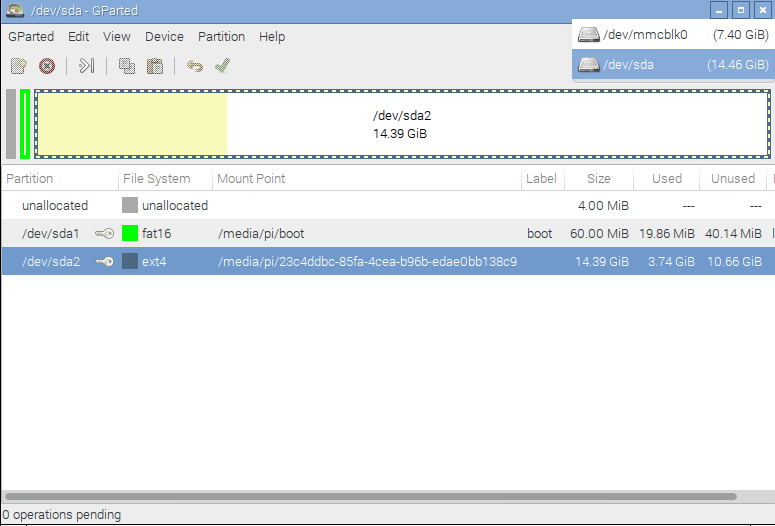
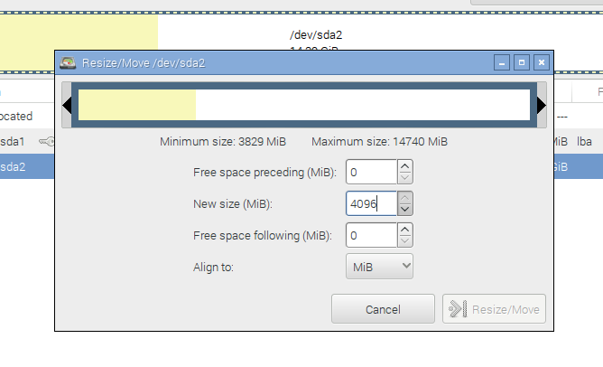

[Home](index.html)

# Description

The original image file for Raspbian is under 4 GB but after running the first time configuration, it is resized to fit the SD card. Depending on your SD card, this could be 16, 32, 64, or even 128 GB. A large image size makes it very difficult to make backups and to share with others. This is easily solved by shrinking the disk partition with GParted.

# Parts List

+ Raspberry Pi 2
+ [USB SD Card Reader](http://www.amazon.com/s/?ie=UTF8&keywords=usb+sd+card+adaptor)

# Overview

Start with a pi running a full Raspbian install, including a vncserver. The pi should be easy to connect to and update. You also need a separate SD card with a disk you would like resized.

1. [Insert the MicroSD and USB](#1)
2. [Install GParted](#2)
3. [Start GParted](#3)
4. [Select the partition](#4)
5. [Resize the partition](#5)
6. [Apply the resize](#6)
7. [Quit](#7)
8. [Conclusion](#Conclusion).

# Procedures

## Insert the MicroSD and USB

+ Insert the MicroSD into the USB card reader
+ Insert the USB card reader into the pi

+ Boot the pi
+ Verify the USB connects, `lsusb`
+ Check for correct reading of the disk, `sudo fdisk -l`
    - It should list at least 2 separate devices. On mine there is _/dev/mmcblk0_ and _/dev/sda_. Each device has 2 partitions. _/dev/sda2_ is the partition to be resized.

## Install GParted

[GParted](http://gparted.org/) is a partition editor for graphically managing your disk partitions. Using standard installation methods, install GParted.

+ `sudo apt_get update`
+ `sudo apt-get install gparted`

## Start GParted

GParted is graphical, so you need to connect to the desktop.

+ Via SSH, `vncserver -nolisten tcp -nevershared -dontdisconnect :1`
+ From your browser connect to the pi's VNC
+ Start a terminal
+ Start GParted with root permissions, `gksudo gparted`

## Select the partition

From the GUI, select the partition. For the example case, it is the second partition on _/dev/sda_. See image.

+ Right click and unmount the selected partition.

## Resize the partition

+ Right click the partition and choose **Resize/Move**
+ In the dialog box, make note of the _Minimum size_. (In example, it is 3829 MB)
+ Enter the size you wish the partition to be in **New size**.
    - Make the new size larger than the minimum size
    - I usually round up to the next 1/2 GB. Since 1 GB = 1024 MB, a 1/2 GB =  512 MB.
+ Click **Resize/Move**

## Apply the resize

+ Click the green check mark to _Apply All Operations_
+ Verify your choice in the dialog
+ If you receive an error, try again with a larger resize

## Quit

+ Quit GParted
+ Disconnet from VNC
+ From SSH, `vncserver -kill :1`
+ `sudo shutdown now`
+ Power down
+ Remove the USB and SD card

# Conclusion

Now that the disk is much smaller, it is much easier to save the image. Go ahead and write the image to disk. There is much more you can do with GParted.
