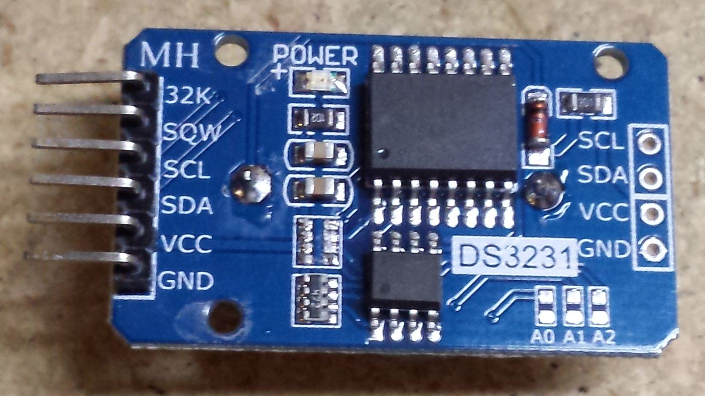
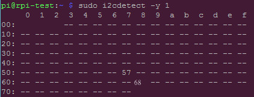

[Home](index.html)

# Description

The DS3231M is a low-cost, extremely accurate I2C real-time clock (RTC) with temperature compensation. It incorporates a battery input and maintains accurate timekeeping when main power to the device is interrupted.

The RTC maintains seconds, minutes, hours, day, date, month, and year information. The date at the end of the month is automatically adjusted for months with fewer than 31 days, including corrections for leap year. Two programmable time-of-day alarms and a programmable square-wave output are provided. Address and data are transferred through an I2C bus.

# Next up?

After reading this guide, you may be interested in reading:

- [Basic GPIO on the Raspberry Pi](rpi_gpio.html)

# Parts List

+ Raspberry Pi 2
+ MicroSD card
+ [DS3231M RTC Module](http://www.amazon.com/s/ref=nb_sb_noss?url=search-alias%3Daps&field-keywords=ds3231)

# Overview

This guide assumes you have an installed and functioning Raspberry Pi. If not please see the [RPi Initial Setup Guide](rpi_initial_setup.html). Here, we cover:

+ Using the DS3231M module as the RTC for a raspberry pi.
    - This allows correct timekeeping, even without an Internet connection, through power down cycles.
+ Extracting valid ambient temperature readings from the RTC.
    - Internally, the temperature is stored in 2s-complement format in the address registers. The temperature is also only updated every 64 seconds or by setting a bit flag.
+ Alarms and calendars will not be covered in this guide.
    - The DS3231 is very capable of calendar and interrupt alarms. These types of alarms are useful for many devices, such as microcontrollers, but not as useful for a microcomputer like the pi.

Using the clock will be demonstrated using python and shell programming. This will include:

+ Setting up I2C on the pi and addressing the RTC
+ Upon boot, initializing and using the RTC for timekeeping
+ Reading and setting the time
+ Converting and reading the temperature using register addressing and bit logic

The steps to follow are:

1. [Connect the RTC](#1)
2. [Configure I2C on your Pi](#2)
3. [Load the clock at boot](#3)
4. [Set date and time](#4)
5. [Converting and reading the temperature](#5)
7. [Conclusion](#Conclusion)
8. [References](#References)

## <a name="1"></a>Connect the RTC

**WARNING: The pi must be powered down whenever you are connecting or disconnecting pins.**

The RTC DS3231M has the following pinouts which should be connected as shown:

+ 32K - 32kHz Output, don't use unless you have a special need.
+ SQW - Active-Low Interrupt or Square-Wave, not used for this guide. These are more useful for microcontrollers.
+ SCL - Serial Clock Input, **connect to SCL**
+ SDA - Serial Data Input/Output, **connect to SDA**
+ VCC - Supply voltage, **connect to 3.3V**.
+ GND - Ground, **connect to ground**

Refer to the following images of the RTC and the pi's GPIO pinouts.




## <a name="2"></a>Configure I2C on your Pi

Unless you have done so previously, I2C must be enabled on your pi.

### Install the utilities

+ `sudo apt-get update`
+ `sudo apt-get install python-smbus`
+ `sudo apt-get install i2c-tools`

### Enable kernel support

+ `sudo raspi-config`.
+ Choose _Advanced Options_ then _I2C_ and select _yes_ to enable the interface.

### Edit the module file

+ `sudo nano /etc/modules`
+ Add the following to the to the end of this file

```
i2c-bcm2708
i2c-dev
rtc-ds1307
```

### Test the bus

Check your I2C bus with, `sudo i2cdetect -y 1`. The output should be similar to



## <a name="3"></a>Load the clock at boot

+ `sudo nano /etc/rc.local`
+ Add the following lines before _exit 0_

```
echo ds1307 0x68 > /sys/class/i2c-adapter/i2c-1/new_device
hwclock -s
```

+ Reboot

## <a name="4"></a>Set date and time

When connected to the Internet, the pi automatically gets the date and time from time servers. These are quite accurate. With the command `hwclock -s` in rc.local, we have set the pi to override this time to match the RTC. This is fine once we have the correct time on the RTC. So let's set it to the correct time.

+ `sudo nptd -g -q` - set the pi's system time to Internet time
+ `date` - check the system time
+ `sudo hwclock -r` - check the date and time of the RTC
+ `sudo hwclock -w` - write the system time to the RTC
+ `sudo hwclock -s` - set the system time from the RTC


## <a name="5"></a>Converting and reading the temperature

The DS3231M has an operating temperature range of -45 C to 85 C. The RTC stores its temperature data in two registers. The upper 8 bits, representing an integer, are stored in two's complement form in register 11h. The lower 2 bits, representing the fractional portion, are in register 12h.

The RTC automatically converts the temperature (updates the registers) every 64s. The maximum allowed by the chip is once every second. A convert may be forced by setting the CONV bit of the Control register (0Eh) to 1. Once the convert is completed, the CONV is set to 0 and the temperature may be read.

The following python code is used to convert, read, and display the temperature.
```
## python

import smbus
import os

# Release RTC 3231
os.system('sudo rmmod rtc_ds1307')

# Setup RTC 3231 for temperature reading
bus = smbus.SMBus(1)
address = 0x68
CONV = 32

# Force a conversion and wait until it completes
def convTemp(address):
    byte_control = bus.read_byte_data(address,0x0E)
    if byte_control&CONV == 0:
        bus.write_byte_data(address, 0x0E, byte_control|CONV)
    byte_control = bus.read_byte_data(address,0x0E)
	while byte_control&CONV != 0:
		time.sleep(1)
		byte_control = bus.read_byte_data(address,0x0E)
    return True

# Get temperature in degrees C
def getTemp(address):
    convTemp(address)
    byte_tmsb = bus.read_byte_data(address,0x11)
    byte_tlsb = bus.read_byte_data(address,0x12)
    tinteger = (byte_tmsb & 0x7f) + ((byte_tmsb & 0x80) >> 7) * -2**8
    tdecimal = (byte_tmsb >> 7) * 2**(-1) + ((byte_tmsb & 0x40) >> 6) * 2**(-2)
    return tinteger + tdecimal

Celsius = getTemp(address)
Fahrenheit = 9.0/5.0 * Celsius + 32
print Fahrenheit, "*F /", Celsius, "*C"

```

## <a name="Conclusion"></a>Conclusion

Your pi now as a battery backed, accurate RTC installed and working. This allows quality data-logging and other applications. Additionally, the temperature data from the RTC is available for your use. In [Basic GPIO on the Raspberry Pi](rpi_gpio.html), temperature data is used to light LEDs and send alerts.

## <a name="References"></a>References

### Adding RTC to I2C

+ [Datasheet](https://datasheets.maximintegrated.com/en/ds/DS3231M.pdf)
+ [Adding a DS3231 Real Time Clock To The Raspberry Pi](http://www.raspberrypi-spy.co.uk/2015/05/adding-a-ds3231-real-time-clock-to-the-raspberry-pi/)
+ [Adding a Real Time Clock to your Raspberry Pi](https://thepihut.com/blogs/raspberry-pi-tutorials/17209332-adding-a-real-time-clock-to-your-raspberry-pi)
+ [What time is it?  How to add a RTC to the Raspberry Pi via I2C](https://www.element14.com/community/community/raspberry-pi/blog/2012/07/19/what-time-is-it-adding-a-rtc-to-the-raspberry-pi-via-i2c)
+ [Adding a Real Time Clock to Raspberry Pi - Adafruit](https://learn.adafruit.com/adding-a-real-time-clock-to-raspberry-pi?view=all)
+ [Raspberry Pi SPI and I2C Tutorial](https://learn.sparkfun.com/tutorials/raspberry-pi-spi-and-i2c-tutorial)

### Get temperature and conversion

+ [Accessing DS3231 Temperature](https://www.raspberrypi.org/forums/viewtopic.php?t=59808&p=956491)
+ [DS3231 RTC Control and Theory with the Bus Pirate](http://notes.pitfall.org/ds3231-rtc-control-and-theory-with-the-bus-pirate.html)
+ [Two's complement](https://en.wikipedia.org/wiki/Two%27s_complement)
